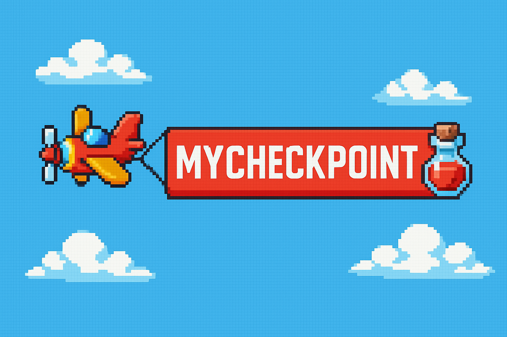

# 🎮 MyCheckPoint

> Plataforma para gamers registrarem, acompanharem e celebrarem sua jornada nos videogames.  
> *A platform for gamers to record, track, and celebrate their gaming journey.*

  

---

### Objetivo

O **MyCheckPoint** é um sistema voltado para gamers que desejam **registrar, acompanhar e celebrar** sua jornada nos videogames. A ideia central é oferecer uma plataforma onde o jogador possa documentar os jogos que está jogando ou já finalizou, enquanto desbloqueia **badges (conquistas)** baseadas em suas atividades.

O sistema busca proporcionar uma experiência divertida, organizada e recompensadora, permitindo que o usuário:

- Registre jogos em andamento ou finalizados;
- Ganhe badges automáticas com base no seu progresso;
- Visualize estatísticas pessoais como horas jogadas, gêneros favoritos, consoles mais usados e frequência de jogo por semana/mês/ano;
- Receba e-mails comemorativos ao conquistar novas badges;
- Pesquise por jogos e, se existentes, visualize informações e imagens automaticamente preenchidas (via integração com API externa);
- Recupere a senha por e-mail, caso necessário.
